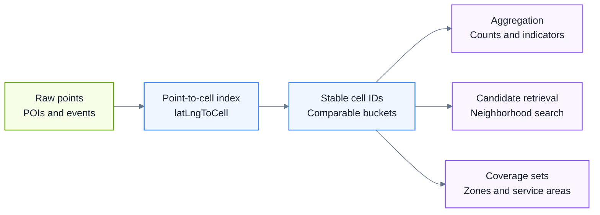
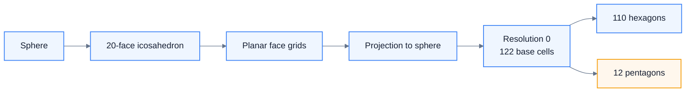
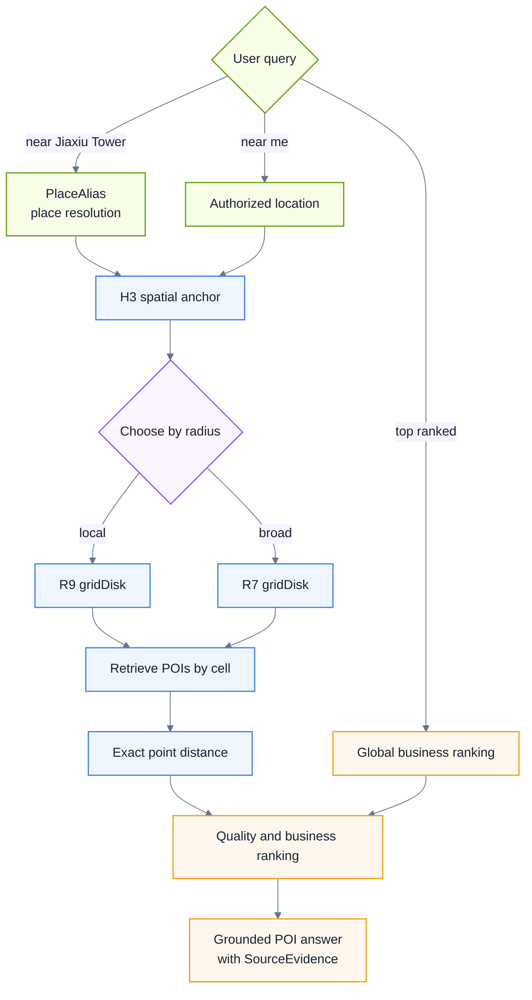

# City Tourism Knowledge Graph

<p align="center">
  <a href="README.md">简体中文</a> · <strong>English</strong>
</p>

An evidence-aware knowledge graph for city tourism question answering, nearby search, itinerary decisions, and multi-source data governance. The current public snapshot covers two data domains:

- **Guiyang:** city and administrative areas, commercial zones, H3 cells, place-name resolution, attractions, food, accommodation, transport, and evidence governance.
- **Thailand:** tourism schemas, data catalogs, quality boundaries, and bilingual ADM0–ADM3 administrative data.

> This repository contains sanitized, deduplicated, and size-compatible snapshots rather than byte-for-byte copies of local collection disks. API keys, access tokens, browser state, local absolute paths, duplicate backups, and unsuitable runtime artifacts are excluded. See [`data/full-data-manifest.json`](data/full-data-manifest.json) for file-level scope, SHA-256 checksums, and exclusions.

**Public status:** the repository and sanitized data snapshot are publicly visible to everyone. Original project code uses the [MIT License](LICENSE). See [DATA-LICENSE.md](DATA-LICENSE.md) for original data structures and derived outputs. Third-party records remain subject to their source terms and content rights; this repository cannot relicense material on behalf of its original rights holders.

## Current scale

| Domain | Local result | Public repository |
| --- | --- | --- |
| Guiyang schema | 30 entity types, 1,098 properties, 18 declared relation types | OpenSPG DSL, parsed form, and platform form |
| Guiyang graph | 96,753 nodes and 398,717 edges; joint validation has 0 errors and 0 warnings | Design documents, validation reports, administration data, and the H3 spatial framework |
| Guiyang spatial layer | 11,297 R8 cells, 1,714 R7 cells, and 157 administrative areas | 13,011 H3 cells plus structured administrative tables |
| Thailand package | 288 canonical source files covering tourism, attractions, food, transport, accommodation, and administration | 288 source files plus 29 worksheet CSV exports; 317 manifest entries |
| Thailand administration | ADM0: 1, ADM1: 77, ADM2: 928, ADM3: 7,436 | CSV and GeoJSON with provenance and quality notes |
| Public CSV data | 55 worksheets from 8 XLSX workbooks exported sheet by sheet | 344 CSV files; the new exports contain 322,911 rows / 182 MB with SHA-256 checksums |
| Complete public snapshot | 160 canonical Guiyang files plus 288 canonical Thailand files | 503 manifest files including 55 derived CSVs; approximately 1.03 GB stored |

## Architecture

```text
User query
   |
   +-- named place --> PlaceAlias --> H3 anchor / cell set
   +-- user location --------------> H3 cell
   +-- "top / best" ---------------> business filters and ranking index
                                         |
                           H3 candidate retrieval
                              (when spatially constrained)
                                         |
                           exact distance, quality,
                            and business reranking
                                         |
                   POI facts + SourceEvidence + content retrieval
```

Core principles:

1. Stable POI facts and social-media experience evidence are separate layers. Amap, Trip.com/Ctrip, and official sources provide stable facts; social content is supporting evidence only after review.
2. H3 retrieves spatial candidates. It does not decide exact distance, administrative statistics, road routes, or which POI is "most popular."
3. Named-place queries, authorized user-location queries, and unconstrained "top" queries use different routing paths. An administrative boundary or a nearby radius is not treated as a permanent ranking boundary.
4. Every cross-source conclusion must be traceable to `DataSource`, `CollectionBatch`, and `SourceEvidence`.
5. `exact / approx / none` determines whether a coordinate may enter nearby ranking. An inherited center point cannot impersonate an independently located POI.

The full Chinese design document is available at [Guiyang knowledge graph technical design](docs/architecture/guiyang-knowledge-graph-design.zh-CN.md).

## H3 technical basis

<p align="center">
  
</p>

<p align="center"><sub>Original project diagram · R7 broad retrieval · R8 spatial framework · R9 POI refinement</sub></p>

### Source and copyright position

The grid design mainly references Isaac Brodsky's Uber Engineering article [H3: Uber’s Hexagonal Hierarchical Spatial Index](https://www.uber.com/us/en/blog/h3/), published on June 27, 2018. Current API names and statistics are checked against the [H3 4.x documentation](https://h3geo.org/docs/). The Uber page is an official engineering article, not a peer-reviewed research paper.

This README contains an original engineering summary and original Mermaid diagrams. It does not reproduce or translate the copyrighted article in full. Visit the [official article and figures](https://www.uber.com/us/en/blog/h3/) for the source text, original images, and author context.

| Bibliographic item | Value |
| --- | --- |
| Title | H3: Uber’s Hexagonal Hierarchical Spatial Index |
| Author | Isaac Brodsky |
| Published | June 27, 2018, Uber Engineering |
| Type | Official engineering article; not peer reviewed |
| Current reference | [H3 4.x documentation](https://h3geo.org/docs/) |

### 1. Why use a grid

A city produces a large volume of geolocated events and POIs. Processing every coordinate directly is expensive and overly granular. Administrative areas, postal zones, and hand-drawn commercial districts are irregular, mutable, and difficult to compare across cities.

H3 first places points into stable, addressable spatial buckets. Aggregation, retrieval, and comparison can then operate on cells. A business district, attraction boundary, or service area can be represented by a set of cells without claiming that the grid itself is an administrative boundary.



### 2. Why hexagons

A regular hexagon has six edge-sharing neighbors at one center-to-center distance. Local traversal and radial approximation are therefore more uniform than in a square or triangular grid. Hexagons also reduce directional distortion for many neighborhood operations.

Hexagons do not tile a sphere perfectly. H3 consequently includes twelve pentagons at every resolution. Algorithms must not assume that every cell has exactly six neighbors.

### 3. How H3 covers the globe

H3 starts from an icosahedron circumscribed around the sphere, constructs grids on its planar faces, and projects them to the spherical surface. Resolution 0 contains 122 base cells: 110 hexagons and 12 pentagons.



### 4. Hierarchical resolutions

H3 provides resolutions 0 through 15. Moving one level finer reduces average cell area to roughly one seventh. A parent therefore has seven logical children in the common case, although class changes and pentagons require the actual H3 APIs rather than handwritten index arithmetic.

The hierarchy is a spatial-index relationship. It is not proof that a cell belongs to a particular district, town, or commercial zone.

| Project role | Resolution | Use |
| --- | ---: | --- |
| Broad retrieval | R7 | Larger radii and coarse candidate reduction |
| Spatial framework | R8 | Citywide cell skeleton and zone/admin intersections |
| Fine POI retrieval | R9 | Small-radius POI candidate lookup |

### 5. A point, centroid, and boundary are different locations

`latLngToCell` returns the cell containing a coordinate. `cellToLatLng` returns the cell centroid, not the original POI coordinate. `cellToBoundary` returns vertices that describe the cell boundary.

The graph keeps original coordinates for final distance calculations. Cell centroids may support coarse visualization or approximation, but they must not replace the POI point in exact nearby ranking.

### 6. Core spatial operations

| Purpose | H3 4.x API | Project rule |
| --- | --- | --- |
| Point to cell | `latLngToCell` | Derive R9/R8/R7 indexes from a declared CRS |
| Cell centroid | `cellToLatLng` | Approximation only; never overwrite the source point |
| Cell boundary | `cellToBoundary` | Visualization and coverage inspection |
| Filled neighborhood | `gridDisk` | Candidate retrieval followed by exact distance filtering |
| Hollow ring | `gridRing` | Ring expansion and diagnostics |
| Grid distance | `gridDistance` | Hop distance, not meters or travel time |
| Parent/children | `cellToParent`, `cellToChildren` | Multi-resolution indexing |
| Polygon coverage | `polygonToCells` | Administrative, scenic, or service-area cell sets |
| Cell-set compression | `compactCells`, `uncompactCells` | Preserve coverage while reducing repeated child indexes |
| Directed neighbor edge | `cellsToDirectedEdge` | Cell adjacency only; not a road or transit route |

For a radius query, the system computes a conservative `k`, expands a `gridDisk`, performs equality lookups per candidate cell, and then filters by exact point distance. Looking up only the origin cell silently misses nearby POIs across a cell edge.


### 7. Relationship to the official figures

The official Uber article illustrates planar hexagons over a map, the icosahedral construction, face orientation, aperture-7 subdivision, point indexing, neighborhoods, compaction, and directed edges. The diagrams in this repository redraw those concepts for this project's architecture. They do not copy the original images.

| Official concept | Project interpretation |
| --- | --- |
| Hexagons over a city map | Stable cells decouple retrieval from mutable administrative boundaries |
| Icosahedral construction | Explains global indexing and the unavoidable pentagons |
| Aperture-7 hierarchy | Supports R7/R8/R9 retrieval without treating levels as administrative containment |
| Point indexing | A POI receives derived cell IDs while retaining its original coordinate |
| Neighborhood traversal | `gridDisk` supplies candidates; exact point distance makes the final cut |
| Compaction | Cell sets can be stored efficiently without changing covered area |
| Directed edges | Useful for cell adjacency, not a replacement for a routing network |

### 8. Application in the Guiyang graph

Guiyang uses both a dual-resolution POI index and a two-level spatial framework:

- Spatial framework: R8 primary layer plus R7 parents.
- Nearby POI lookup: R9 refinement plus R7 broad-radius retrieval.
- Place-name resolution: `PlaceAlias` stores usable H3 anchors directly. Ambiguous candidates are considered by priority, selecting the first candidate that can actually be located.
- Final filtering: exact distance, `geoPrecision`, data quality, operating status, and business rules run after H3 candidate retrieval.



Typical query behavior:

| Query | Spatial strategy |
| --- | --- |
| "What is near Jiaxiu Tower?" | Resolve the name to a locatable H3 anchor, expand a safe neighborhood, then filter against original coordinates |
| "What is near me?" | Convert the authorized user location to the canonical CRS and run the same neighborhood flow |
| "What is the best / highest-rated place in Guiyang?" | Apply global business filters and ranking first; H3 participates only when the query also contains a location constraint |

The current validation snapshot contains 38,107 POIs with exact usable R9/R7 indexes, 13,011 R8/R7 framework cells, and 40,106 `PlaceAlias` entries with spatial anchors. See [`data/guiyang/H3_INDEX_VALIDATION.json`](data/guiyang/H3_INDEX_VALIDATION.json).

### 9. CRS and implementation boundaries

H3 4.x uses spherical latitude/longitude semantics based on the WGS84 / EPSG:4326 authalic radius. The library does not convert GCJ-02, WGS84, or BD-09:

1. GCJ-02 numbers passed directly to H3 are treated as ordinary latitude and longitude, producing cell IDs shifted relative to WGS84.
2. Coordinates and H3 IDs in the current Guiyang snapshot are internally paired, but they must not be mixed with IDs generated from a different CRS.
3. Cross-city exchange should retain source coordinates, source CRS, standardized WGS84 coordinates, and their derived H3 IDs. China-specific display coordinates remain separate.
4. A CRS migration requires recomputing every R9/R8/R7 index, `PlaceAlias` anchor, and derived spatial relationship.

H3 is not an administrative-boundary database, an exact-distance engine, a road router, or a popularity model. Its role here is scalable, hierarchical candidate retrieval.

More detail is available in [H3 reference and project mapping](docs/references/h3-spatial-index.md).

## Data-source boundaries

| Source | Role in the graph | Publication policy |
| --- | --- | --- |
| Official administration, open boundaries, open transport | Spatial framework and public facts | Publish according to source licenses and attribution requirements |
| Amap, Google Maps / Places | POI discovery, coordinates, and business attributes | Sanitized research snapshot only; source terms still govern reuse |
| Ctrip / Trip.com | Accommodation and attraction snapshots | Sanitized research snapshot; dynamic prices and platform rights are not represented as open licenses |
| Xiaohongshu / Diandian AI | Demand discovery and experience evidence | Only sanitized repository snapshots; no temporary access parameters, login state, or local private information; reuse must follow source terms |
| Baidu Baike, official sites, government sites | Cultural history and factual verification | Store citations and evidence rather than mirror copyrighted articles |

See [publication and governance policy](docs/governance/publication-policy.zh-CN.md).

## Open use and rights boundaries

- Public visibility lets anyone browse, search, and download the current files.
- Code is available under the [MIT License](LICENSE). Licensing for original schemas, dictionaries, H3-derived structures, and original documentation is described in [DATA-LICENSE.md](DATA-LICENSE.md).
- Third-party records from Amap, Google, Ctrip / Trip.com, Xiaohongshu, Baidu Baike, and other sources retain their original rights boundaries. Public access does not mean this project can grant an unrestricted license to third-party material.
- API keys, cookies, login state, local paths, and temporary access tokens are excluded or replaced with `[REDACTED]`.

## Repository layout

```text
docs/
  architecture/        Knowledge-graph and retrieval design
  references/          H3 and other technical references
  governance/          Publication, provenance, and evidence rules
schemas/
  guiyang/             Guiyang OpenSPG schema
  thailand/            Thailand tourism schema
data/
  full-data-manifest.json     File-level full-snapshot manifest and checksums
  csv-export-manifest.json    XLSX-to-CSV sheet mapping, dimensions, and checksums
  guiyang/full_v11_2/         Sanitized Guiyang v11.2 snapshot
  thailand/full_20260913/     Sanitized Thailand 2026-09-13 snapshot
  **/csv_export/              One UTF-8 CSV per XLSX worksheet
  guiyang/spatial/            Guiyang city, administration, and H3 cells
  guiyang/validation/         Graph validation reports
  thailand/catalog/          Thailand data catalog and quality boundaries
  thailand/administrative/   Thailand ADM0–ADM3 CSV / GeoJSON
scripts/
  export_xlsx_to_csv.py       Reproducible worksheet-level CSV export
  validate_full_data_snapshot.py
  validate_guiyang_h3_index.py
```

## Quick verification

```bash
# Public Guiyang H3 rows; including the header, this should be 13,012.
wc -l data/guiyang/spatial/guiyang-h3-cells-r7-r8.csv

# Validate JSON syntax.
find schemas data -name '*.json' -print0 | xargs -0 -n1 jq empty

# Validate counts, GeoJSON, file sizes, and sensitive patterns.
python scripts/validate_public_snapshot.py

# Validate file-level SHA-256 values, missing files, and sensitive data.
python scripts/validate_full_data_snapshot.py

# Re-export all 55 XLSX worksheets to UTF-8 CSV and refresh manifests.
python scripts/export_xlsx_to_csv.py

# Validate Guiyang R9/R8/R7, PlaceAlias anchors, and framework consistency.
python scripts/validate_guiyang_h3_index.py

# Lint the Guiyang schema. Ten shared-vocabulary notices are known warnings.
python scripts/lint_guiyang_schema.py schemas/guiyang/CityTourism.schema
```

## References

- [Isaac Brodsky, "H3: Uber’s Hexagonal Hierarchical Spatial Index," Uber Engineering, 2018-06-27](https://www.uber.com/us/en/blog/h3/)
- [H3 documentation: system overview](https://h3geo.org/docs/core-library/overview/)
- [H3 documentation: resolution statistics](https://h3geo.org/docs/core-library/restable/)
- [H3 4.x API: traversal and neighborhoods](https://h3geo.org/docs/api/traversal/)
- [H3 4.x API: hierarchy](https://h3geo.org/docs/api/hierarchy/)
- [H3 4.x API: regions and cell sets](https://h3geo.org/docs/api/regions/)
- [H3 4.x API: directed edges](https://h3geo.org/docs/api/uniedge/)
