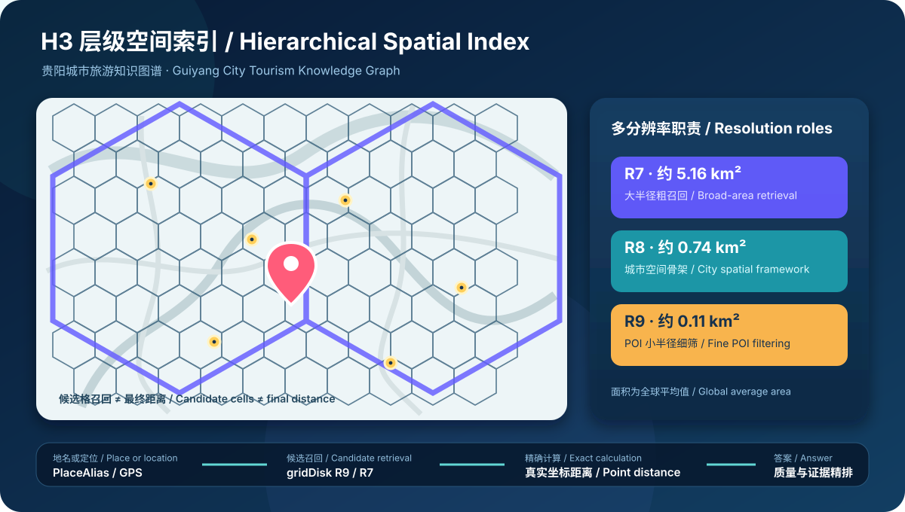
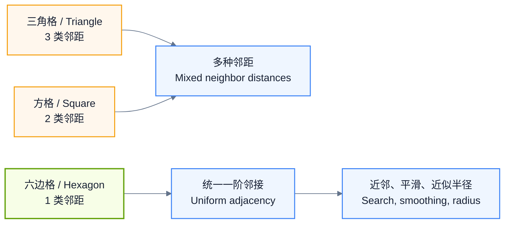
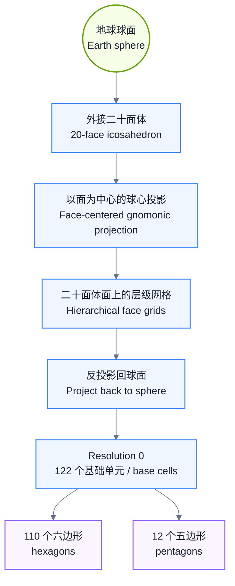
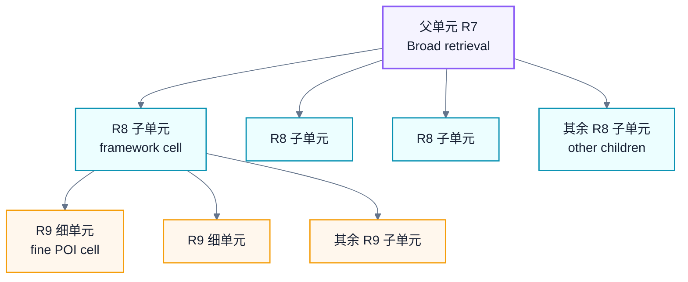
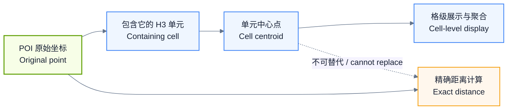
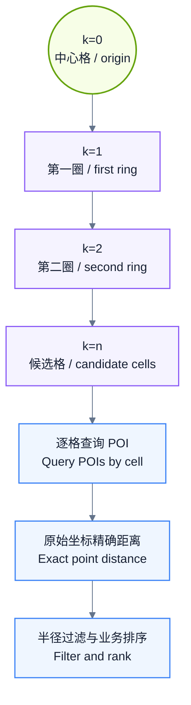
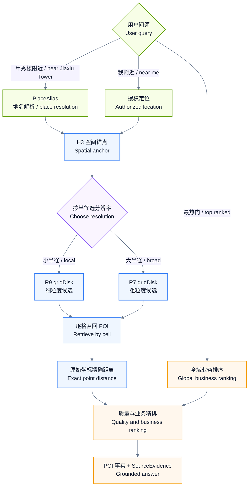

# 城市旅游知识图谱

面向城市旅游问答、附近检索、行程决策和多来源证据治理的知识图谱工程。当前公开快照覆盖两个数据域：

- 贵阳：城市、行政区、商圈、H3 网格、地名解析、景区、美食、酒店、交通和证据治理。
- 泰国：旅游 Schema、数据目录、质量边界，以及 ADM0–ADM3 中泰双语行政区数据。

> 本仓库包含经过脱敏、去重和大文件压缩的贵阳与泰国数据快照，但不是本地采集盘的逐字节镜像。API Key、访问令牌、浏览器状态、本机绝对路径、重复备份和不适合公开的运行文件均已排除；逐文件范围、SHA-256 与排除原因见 [`data/full-data-manifest.json`](data/full-data-manifest.json)。

## 当前规模

| 数据域 | 本地成果 | 本仓库公开内容 |
| --- | --- | --- |
| 贵阳 Schema | 30 个实体、1,098 个属性、18 种声明关系 | OpenSPG DSL、解析版和平台版 |
| 贵阳图谱 | 96,753 个节点、398,717 条关系，联合校验 0 error / 0 warning | 设计、验证报告、行政区和 H3 空间骨架 |
| 贵阳空间层 | R8 11,297 格、R7 1,714 格、157 个行政区 | 13,011 个 H3 单元及行政区结构化表 |
| 泰国整理包 | 257 个登记文件，覆盖旅游、景点、美食、交通、酒店和行政区 | Schema、文件清单、质量边界、ADM0–ADM3 数据 |
| 泰国行政区 | ADM0 1、ADM1 77、ADM2 928、ADM3 7,436 | CSV 与 GeoJSON，附来源和质量说明 |

## 总体设计

```text
用户问题
   │
   ├─ 地名 ──> PlaceAlias ──> H3 锚点/格集
   ├─ 用户定位 ──────────────> H3 单元
   └─ “最热门/最适合” ───────> 业务筛选与排序索引
                                  │
                    H3 候选召回（需要空间约束时）
                                  │
                     精确距离、质量和业务精排
                                  │
        POI 事实层 + SourceEvidence 证据层 + 内容检索层
```

核心原则：

1. POI 事实主库与社媒体验证据分层。高德、携程、官方资料负责稳定事实；小红书等内容只作为审核后的体验证据。
2. H3 负责空间候选召回，不负责最终距离、行政区统计或“最热门”结论。
3. 地名、用户定位和无空间边界的“最 XX”查询采用不同路由，不把行政区或附近半径当成永远不能突破的边界。
4. 所有跨源结论必须能追溯到 DataSource、CollectionBatch 和 SourceEvidence。
5. `exact / approx / none` 决定坐标能否进入附近排序；近似中心点不得冒充独立 POI 点位。

完整设计见[贵阳知识图谱技术设计](docs/architecture/guiyang-knowledge-graph-design.zh-CN.md)。

## H3 技术依据 / H3 Technical Basis

<p align="center">
  
</p>

<p align="center"><sub>原创项目图 / Original project diagram · R7 大范围召回 · R8 空间骨架 · R9 POI 细筛</sub></p>

**阅读语言 / Language:** 中文正文在前；[English companion summary](#10-english-companion-summary) 在本节末尾。Uber 原文及其全部原图请访问 [official article and figures](https://www.uber.com/us/en/blog/h3/)。

### 文献定位与版权说明 / Source and copyright

本项目的网格设计主要参考 Isaac Brodsky 于 2018 年 6 月 27 日发布的 Uber Engineering 文章 [H3: Uber’s Hexagonal Hierarchical Spatial Index](https://www.uber.com/us/en/blog/h3/)，并以 [H3 4.x 官方文档](https://h3geo.org/docs/)校正当前 API 名称和统计值。该文章是官方工程实践说明，不是同行评审学术论文。

以下文字是面向本项目的中文技术摘要；图表均为本仓库依据公开技术事实重新绘制的 Mermaid 图，不复制 Uber 原文或原始配图。原始图像、完整上下文和作者表述请以 Uber 页面为准。

> 原文短引 / Short excerpt: “Grid systems are critical to analyzing large spatial data sets.” 中文意译：网格系统是分析大规模空间数据的重要基础。

| 书目信息 | 中文 | English |
| --- | --- | --- |
| 标题 / Title | H3：Uber 的六边形层级空间索引 | H3: Uber’s Hexagonal Hierarchical Spatial Index |
| 作者 / Author | Isaac Brodsky | Isaac Brodsky |
| 发布 / Published | 2018 年 6 月 27 日，Uber Engineering | June 27, 2018, Uber Engineering |
| 类型 / Type | 官方工程文章，非同行评审论文 | Official engineering article, not a peer-reviewed paper |
| 原文与原图 / Original | [打开 Uber 原始页面](https://www.uber.com/us/en/blog/h3/) | [Read the article and view all original figures](https://www.uber.com/us/en/blog/h3/) |

### 1. 为什么需要网格 / Why grids

城市每天产生大量带位置的事件和 POI。直接按每个经纬度做全城分析，粒度过细且计算昂贵；直接使用行政区、邮编区或人工商圈，又会遇到边界形状和面积不一致、边界随管理口径变化、跨城市不可比较等问题。

H3 的思路是把点先装入稳定、可寻址的空间桶，再在桶上聚合、检索和比较。网格不要求与街道或社区边界重合；需要表达商圈、景区范围或服务区时，可以用一组 H3 单元表示，成员判断接近集合查询。

```mermaid
%%{init: {"theme":"base","themeVariables":{"background":"#ffffff","primaryColor":"#eef6ff","primaryTextColor":"#172033","primaryBorderColor":"#3b82f6","lineColor":"#64748b","secondaryColor":"#f5f3ff","tertiaryColor":"#f7fee7","fontFamily":"Arial"}}}%%
flowchart LR
    A[经纬度事件或 POI<br/>Geospatial events or POIs] --> B[latLngToCell<br/>映射到 H3 单元]
    B --> C[(H3 空间分桶<br/>Spatial buckets)]
    C --> D[按格聚合<br/>Aggregate metrics]
    D --> E[候选召回与业务决策<br/>Retrieval and decisions]
    E --> F[原始坐标精确计算<br/>Exact point calculation]
    classDef input fill:#f7fee7,stroke:#65a30d,color:#172033,stroke-width:1.5px;
    classDef process fill:#eff6ff,stroke:#3b82f6,color:#172033,stroke-width:1.5px;
    classDef store fill:#f5f3ff,stroke:#8b5cf6,color:#172033,stroke-width:1.5px;
    class A input;
    class B,D,E,F process;
    class C store;
```



这对应 Uber 原文图 2 的核心过程：原始点 → 点所在六边形 → 按六边形汇总后的空间指标。

### 2. 为什么选择六边形 / Why hexagons

| 网格形状 | 相邻中心距离类型 | 工程影响 |
| --- | ---: | --- |
| 三角形 | 3 类 | 邻接方向和距离不统一，平滑与半径近似更复杂 |
| 正方形 | 2 类 | 共边邻居和对角邻居距离不同 |
| 六边形 | 1 类 | 六个共边邻居到中心的距离一致，便于邻域、梯度平滑和近似圆形范围分析 |

六边形不能消除所有投影误差，也不等于真实圆形半径；它的优势是邻接关系更均匀。Uber 文章还强调，网格可减少移动事件跨越任意业务边界时产生的量化问题，并使不同城市使用形状和尺度可比较的空间单元。



### 3. H3 如何覆盖地球 / How H3 covers the globe

H3 是离散全球网格系统（DGGS）。它不是简单地在墨卡托平面上铺六边形，而是在包围球体的二十面体各平面上建立网格，再通过以面为中心的球心投影映射到球面。



关键约束：

- 二十面体顶点采用与 Dymaxion 相关的固定朝向；H3 官方说明该朝向把 12 个顶点放在海洋中，以减少五边形异常对常用陆地区域的影响。
- 球面或二十面体不可能只用六边形无缝铺满，所以**每一个分辨率都恰好存在 12 个五边形**。
- 遍历、环扩展和局部坐标算法必须处理五边形畸变，不能假设所有格子都有六个普通邻居。
- Resolution 0 有 122 个基础单元：110 个六边形和 12 个五边形。全局第 `r` 级单元总数为 `2 + 120 × 7^r`。

### 4. 层级分辨率 / Hierarchical resolutions

H3 提供 Resolution 0–15 共 16 级。每升一级，普通六边形平均面积约变为上一级的 `1/7`，典型长度尺度约缩小为 `1/√7`。普通六边形有 7 个直接子单元；五边形有 6 个直接子单元（5 个六边形和 1 个五边形）。

每个单元使用一个 64 位 H3 索引编码模式、分辨率、基础单元和逐级方向位；在 JSON、CSV 和 JavaScript 环境中通常保存为十六进制字符串，避免无符号 64 位整数在不同语言之间发生精度或符号问题。



层级索引适合父子查询和集合压缩，但父子边界不是普通平面上的完美七等分。父单元与全部子单元的覆盖关系是 H3 层级定义，不应把“父 ID”误当作精确行政边界或几何包含证明。

本项目实际使用的三级参数如下。面积是全球平均六边形面积；R7 以后平均边长为官方统计中的外推值，具体单元会随位置变化。

| 分辨率 | 全球平均面积 | 全球平均边长 | 贵阳项目用途 |
| ---: | ---: | ---: | --- |
| R7 | 5.161293 km² | 1.406476 km | 大半径粗召回、R8 父层、跨片区检索 |
| R8 | 0.737328 km² | 0.531414 km | 城市空间骨架、行政区与商圈分析单元 |
| R9 | 0.105333 km² | 0.200786 km | POI 小半径细筛和地名精细锚点 |

### 5. 点、格心和边界不是同一个位置 / Point, centroid, and boundary

H3 把输入点映射到“包含该点的单元”，但单元中心不是原始点。原文图 9 专门说明了原始点与格心可能存在明显偏移。



因此本项目禁止用 H3 格心冒充 POI 坐标，也禁止把继承景区中心的 `approx` 子景点放入就近排序。H3 用于缩小候选集；最终距离必须使用通过质量门槛的原始经纬度。

### 6. 主要空间操作 / Core spatial operations

Uber 2018 年文章使用的是 H3 早期 API 名称，H3 4.x 已更名：

| 能力 | 2018 文章中的名称 | H3 4.x 名称 | 本项目用途 |
| --- | --- | --- | --- |
| 经纬度落格 | `geoToH3` | `latLngToCell` | POI、地名和用户定位生成索引 |
| 格心 | `h3ToGeo` | `cellToLatLng` | 格级展示，不能替代 POI 坐标 |
| 格边界 | `h3ToGeoBoundary` | `cellToBoundary` | 地图绘制与覆盖检查 |
| k 环/邻域盘 | `kRing` | `gridDisk` | “附近有什么”的候选格集合 |
| 网格跳数 | 旧版距离 API | `gridDistance` | 同分辨率单元间最少邻接跳数，不是真实米制距离 |
| 父子层级 | 旧版层级 API | `cellToParent` / `cellToChildren` | R9、R8、R7 切换 |
| 多边形覆盖 | polyfill 类 API | `polygonToCells` / `cellsToMultiPolygon` | 行政区、景区和商圈与格集互转 |
| 集合压缩 | `compact` / `uncompact` | `compactCells` / `uncompactCells` | 大范围格集压缩与恢复 |
| 定向边 | directed edge API | `cellsToDirectedEdge` 等 | 相邻格之间的移动表达 |

#### 邻域与 k 环 / Neighborhoods and k-rings

`gridRing(k)` 返回与中心恰好相距 `k` 跳的空心环；`gridDisk(k)` 返回距离不超过 `k` 的实心邻域。普通无限六边网格中，`k > 0` 的单环最大为 `6k` 个单元；五边形附近必须使用能处理畸变的安全实现。

`gridDistance` 返回两个同分辨率单元之间的最少网格跳数；分辨率不同、距离过远或路径跨越五边形畸变时可能无法计算。网格跳数只适合拓扑粗排，不能替代球面距离、步行距离或驾车时间。



只查中心格会漏掉位于相邻格、但实际距离很近的 POI；只依赖 k 环又会产生边角位置的超半径候选。因此标准流程必须是“安全 k 环召回 + 精确距离过滤”。

#### 集合压缩与恢复 / Compact and uncompact

如果一组同分辨率子单元完整覆盖某个父单元，`compactCells` 可用父单元替换这些子单元，形成混合分辨率但覆盖等价的更小集合；`uncompactCells` 可恢复到指定分辨率。Uber 原文给出的示例把 10,633 个 R6 单元压缩为 901 个不高于 R6 的单元。

```mermaid
%%{init: {"theme":"base","themeVariables":{"background":"#ffffff","primaryColor":"#eef6ff","primaryTextColor":"#172033","primaryBorderColor":"#3b82f6","lineColor":"#64748b","secondaryColor":"#f5f3ff","tertiaryColor":"#f7fee7","fontFamily":"Arial"}}}%%
flowchart LR
    A[大量同级子单元<br/>Many same-resolution cells] -->|compactCells| B[较少的混合级单元<br/>Compact mixed resolutions]
    B -->|uncompactCells| C[目标分辨率格集<br/>Target-resolution set]
    C --> D[覆盖范围等价<br/>Equivalent coverage]
    classDef source fill:#fff7ed,stroke:#f59e0b,color:#172033,stroke-width:1.5px;
    classDef compact fill:#f5f3ff,stroke:#8b5cf6,color:#172033,stroke-width:2px;
    classDef result fill:#eff6ff,stroke:#3b82f6,color:#172033,stroke-width:1.5px;
    class A source;
    class B compact;
    class C,D result;
```



#### 定向边 / Directed edges

H3 可把两个相邻单元之间的移动编码成定向边，并从边恢复起点和终点。这适合表达格级流量或移动，但不是道路拓扑；真实驾车、步行和公共交通仍需 Route、TransitRoute 或专业路径规划数据。

```mermaid
%%{init: {"theme":"base","themeVariables":{"background":"#ffffff","primaryColor":"#eef6ff","primaryTextColor":"#172033","primaryBorderColor":"#3b82f6","lineColor":"#64748b","secondaryColor":"#f5f3ff","tertiaryColor":"#f7fee7","fontFamily":"Arial"}}}%%
flowchart LR
    A[起点 H3 单元<br/>Origin cell] -->|定向邻接边 / directed edge| B[终点 H3 单元<br/>Destination cell]
    B --> C[格级 OD 与流量<br/>Cell-level movement]
    C -. 不能替代 / cannot replace .-> D[真实道路和交通路线<br/>Road and transit routes]
    classDef cell fill:#eff6ff,stroke:#3b82f6,color:#172033,stroke-width:1.5px;
    classDef metric fill:#f5f3ff,stroke:#8b5cf6,color:#172033,stroke-width:1.5px;
    classDef route fill:#fff7ed,stroke:#f59e0b,color:#172033,stroke-width:1.5px;
    class A,B cell;
    class C metric;
    class D route;
```



### 7. Uber 原文图表与本 README 的对应关系 / Figure crosswalk

| Uber 原文图 | 原图主题（中文） | Original topic | 本 README 的原创表达 |
| ---: | --- | --- | --- |
| 1 | 全球六边形划分 | Global hexagonal partition | “H3 如何覆盖地球”流程图 |
| 2 | 点事件 → 六边形 → 按数量着色 | Points → cells → aggregated shading | “为什么需要网格”流程图 |
| 3–4 | 邮编区与六边形聚类对比 | Postal zones vs. hex clusters | 网格与传统边界的说明 |
| 5 | 球体、二十面体与球心投影 | Sphere, icosahedron, gnomonic projection | 二十面体投影流程图 |
| 6 | 三角形、方形、六边形邻距 | Neighbor distances by cell shape | 三种网格对比图 |
| 7 | 单个二十面体面上的 H3 网格 | Grid on one icosahedron face | 基础单元构造说明 |
| 8 | 分辨率逐级细化 | Hierarchical subdivision | R7 → R8 → R9 层级图 |
| 9 | 原始点、所在格与格心偏移 | Point, containing cell, and centroid | 点与格心职责图 |
| 10 | k=0、1、2 的邻域 | Grid neighborhoods at k=0, 1, 2 | k 环候选召回图 |
| 11 | compact / uncompact | Compact and uncompact cell sets | 集合压缩与恢复图 |
| 12 | 相邻单元定向边 | Directed edge between neighbors | 定向边图 |

> **原图入口 / Original figures:** [Uber 原文与全部 12 幅图](https://www.uber.com/us/en/blog/h3/) · [Figure 1 官方图片](https://cn-geo1.uber.com/image-proc/crop/resizecrop/udam/format%3Dauto/width%3D552/height%3D0/srcb64%3DaHR0cHM6Ly90Yi1zdGF0aWMudWJlci5jb20vcHJvZC91ZGFtLWFzc2V0cy9jYjhkZjIwZS0xNmJmLTVjZjctODg0MS03MWQ4YWY5YjFhODIucG5n) · Figure 2 [原始点](https://cn-geo1.uber.com/image-proc/resize/udam/format%3Dauto/quality%3D0/width%3D280/srcb64%3DaHR0cHM6Ly90Yi1zdGF0aWMudWJlci5jb20vcHJvZC91ZGFtLWFzc2V0cy85NzFkYzVhMC1lYmRhLTUxNWQtODk0MS02ZDQzNjQ1ODdlN2EucG5n)、[六边形分桶](https://cn-geo1.uber.com/image-proc/resize/udam/format%3Dauto/quality%3D0/width%3D280/srcb64%3DaHR0cHM6Ly90Yi1zdGF0aWMudWJlci5jb20vcHJvZC91ZGFtLWFzc2V0cy9kZGY1ODBkNC02NGExLTUxODYtYjI1NS04M2I3MjBmNTViODkucG5n)、[聚合着色](https://cn-geo1.uber.com/image-proc/resize/udam/format%3Dauto/quality%3D0/width%3D280/srcb64%3DaHR0cHM6Ly90Yi1zdGF0aWMudWJlci5jb20vcHJvZC91ZGFtLWFzc2V0cy8wZGQwYTcxOS0yNDQwLTUwNzgtYTExZC1lNzE3YWFmZjc2ODEucG5n)。链接指向 Uber 官方资源，仓库不镜像这些版权图片。

### 8. 在贵阳知识图谱中的落地 / Application in the Guiyang graph

贵阳采用双分辨率 POI 索引和双层空间骨架：

- 空间骨架：R8 主层 + R7 父层。
- POI 就近查询：R9 细筛 + R7 大半径粗筛。
- 地名解析：`PlaceAlias` 直接保存可用的 H3 锚点；同名候选按优先级选择第一个可定位对象。
- 最终筛选：H3 只负责候选召回，之后必须执行精确距离、实体质量、营业状态和业务规则过滤。



三类典型查询：

| 查询 | 空间策略 |
| --- | --- |
| “甲秀楼附近有什么” | 地名解析到一个可定位 H3 锚点，展开安全 k 环，再按原始坐标精确过滤 |
| “我附近有什么” | 将用户授权定位转换到统一坐标口径后落格，再执行相同邻域流程 |
| “贵阳最值得去/评分最高” | 先走全域业务过滤和排序；只有同时出现位置限制时才让 H3 参与 |

当前校验快照已经验证：38,107 个 POI 具有可精确使用的 R9/R7 索引，空间框架包含 13,011 个 R8/R7 单元，40,106 个 `PlaceAlias` 条目具有可用空间锚点。详见 [`data/guiyang/H3_INDEX_VALIDATION.json`](data/guiyang/H3_INDEX_VALIDATION.json)。

### 9. 坐标系与实现边界 / CRS and implementation boundaries

H3 4.x 使用基于 WGS84 / EPSG:4326 等积球半径的球面坐标语义。H3 库不会自动执行 GCJ-02、WGS84 或 BD-09 转换：

1. 输入 GCJ-02 数值时，H3 仍会把它当作普通经纬度，生成相对于 WGS84 位置发生偏移的格 ID。
2. 当前贵阳快照中的坐标与既有 H3 ID 保持内部成对一致，但不能与由 WGS84 坐标生成的 H3 ID 混合比较。
3. 面向跨城市交换和长期标准化，应保存来源坐标、坐标系、标准 WGS84 坐标及其 H3 ID；中国地图展示坐标单独保留。
4. 如果迁移坐标基准，必须从标准坐标重算全部 R9/R8/R7 索引、`PlaceAlias` 锚点和派生关系，不能只改经纬度文本。

H3 的能力边界同样明确：它不是行政区边界库、不是真实距离引擎、不是道路路由器，也不是“最热门”排序模型。它在本项目中的职责是可扩展、可分层的空间候选召回。

### 10. English companion summary

This section is an original English companion to the Chinese project guide above. It summarizes the engineering ideas from Uber’s article and current H3 4.x documentation; it is not a reproduction or full translation of the copyrighted source.

| Topic | English summary |
| --- | --- |
| Why grids | Exact point-by-point city analysis is expensive, while administrative or hand-drawn zones are irregular and mutable. H3 gives events and POIs stable, comparable spatial buckets. |
| Why hexagons | A regular hexagon has one center-to-center distance for its six edge-sharing neighbors. This makes local traversal and radial approximation more uniform than square or triangular grids. |
| Global construction | H3 builds grids on the planar faces of a sphere-circumscribed icosahedron and projects them to the sphere. Resolution 0 contains 122 base cells: 110 hexagons and 12 pentagons. |
| Hierarchy | H3 exposes resolutions 0–15. Each finer level has roughly one seventh of the parent level’s average cell area. Parent-child relationships are index relationships, not administrative containment claims. |
| Point versus centroid | `latLngToCell` returns the cell containing a point. The cell centroid is not the original POI location and must not be used as a substitute for exact-distance ranking. |
| Neighborhoods | `gridDisk(k)` returns cells within `k` grid steps. Candidate cells must still be followed by exact point-distance filtering because a grid disk only approximates a metric radius. |
| Compression | `compactCells` replaces complete child sets with coarser parents; `uncompactCells` expands a mixed-resolution set to a requested resolution while preserving coverage. |
| Directed edges | H3 can encode movement between neighboring cells, but those edges are not road, walking, or transit routes. |
| Guiyang design | R9 is used for fine POI retrieval, R8 for the city framework, and R7 for broad retrieval. `PlaceAlias` resolves named places to spatial anchors before neighborhood expansion. |
| CRS boundary | H3 expects ordinary spherical latitude/longitude semantics and does not convert GCJ-02, WGS84, or BD-09. A CRS migration requires recomputing every derived H3 index. |

#### Bilingual glossary / 中英术语表

| 中文 | English | H3 4.x API or project field |
| --- | --- | --- |
| 经纬度落格 | Point-to-cell indexing | `latLngToCell` |
| 单元中心 | Cell centroid | `cellToLatLng` |
| 单元边界 | Cell boundary | `cellToBoundary` |
| 实心邻域 | Filled grid neighborhood | `gridDisk` |
| 空心环 | Hollow grid ring | `gridRing` |
| 网格跳数 | Grid distance in hops | `gridDistance` |
| 父子层级 | Parent-child hierarchy | `cellToParent` / `cellToChildren` |
| 多边形覆盖 | Polygon-to-cell coverage | `polygonToCells` |
| 集合压缩 | Cell-set compaction | `compactCells` |
| 定向邻接边 | Directed neighbor edge | `cellsToDirectedEdge` |
| 地名空间锚点 | Place-name spatial anchor | `PlaceAlias.targetCell` |
| 精确坐标 / 近似坐标 / 无坐标 | Exact / approximate / no coordinate | `geoPrecision` |

更完整的技术记录见 [H3 参考与项目映射](docs/references/h3-spatial-index.md)。

## 数据来源边界

| 来源 | 在图谱中的角色 | 公开策略 |
| --- | --- | --- |
| 官方行政区、开放边界、开放交通 | 空间框架与公共事实 | 按来源许可和署名公开 |
| 高德、Google Maps / Places | POI 发现、坐标与业务字段 | 不公开原始响应或全量平台数据 |
| 携程、Trip.com | 酒店与景点快照 | 不公开受限详情、评论和动态价格 |
| 小红书 / 点点 AI | 需求发现与体验证据 | 不公开帖子全文、作者信息或临时访问参数 |
| 百度百科、官网、政府网站 | 历史文化与事实核验 | 保存引用和证据，不镜像整篇受版权保护内容 |

详见[公开数据与治理策略](docs/governance/publication-policy.zh-CN.md)。

## 仓库目录

```text
docs/
  architecture/        知识图谱与检索设计
  references/          H3 等技术参考
  governance/          公开、来源和证据治理规则
schemas/
  guiyang/             贵阳 OpenSPG Schema
  thailand/            泰国旅游 Schema
data/
  full-data-manifest.json     全量快照逐文件清单、校验和与排除说明
  guiyang/full_v11_2/         贵阳 v11.2 脱敏数据快照
  thailand/full_20260913/     泰国 2026-09-13 脱敏数据快照
  guiyang/spatial/     贵阳城市、行政区和 H3 网格
  guiyang/validation/  图谱验证报告
  thailand/catalog/    泰国本地全量数据目录与质量边界
  thailand/administrative/  泰国 ADM0–ADM3 CSV / GeoJSON
```

## 快速核验

```bash
# 贵阳公开 H3 单元数（含表头应为 13,012 行）
wc -l data/guiyang/spatial/guiyang-h3-cells-r7-r8.csv

# JSON 文件语法检查
find schemas data -name '*.json' -print0 | xargs -0 -n1 jq empty

# 一次完成行数、GeoJSON、文件大小和敏感信息检查
python scripts/validate_public_snapshot.py

# 全量快照逐文件 SHA-256、缺失项和敏感信息复核
python scripts/validate_full_data_snapshot.py

# 贵阳 R9/R8/R7、PlaceAlias 与框架网格一致性检查
python scripts/validate_guiyang_h3_index.py

# 贵阳 Schema 结构自检（10 条共享词表提示为已知 warning）
python scripts/lint_guiyang_schema.py schemas/guiyang/CityTourism.schema

# 查看当前提交中最大的文件
git ls-files -z | xargs -0 du -h | sort -h | tail
```

## 参考资料

- [Isaac Brodsky, “H3: Uber’s Hexagonal Hierarchical Spatial Index,” Uber Engineering, 2018-06-27](https://www.uber.com/us/en/blog/h3/)
- [H3 官方文档：系统概览](https://h3geo.org/docs/core-library/overview/)
- [H3 官方文档：各分辨率单元统计](https://h3geo.org/docs/core-library/restable/)
- [H3 4.x API：网格遍历与邻域](https://h3geo.org/docs/api/traversal/)
- [H3 4.x API：父子层级](https://h3geo.org/docs/api/hierarchy/)
- [H3 4.x API：多边形与格集](https://h3geo.org/docs/api/regions/)
- [H3 4.x API：定向边](https://h3geo.org/docs/api/uniedge/)
- [H3 官方仓库](https://github.com/uber/h3)
